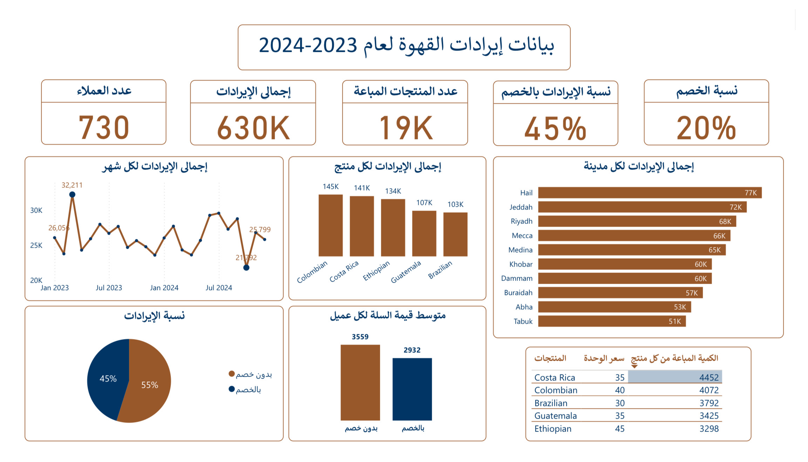

# ☕ داشبورد بيانات إيرادات القهوة

هذا المشروع عبارة عن تقرير Power BI لتحليل بيانات مبيعات القهوة لعام 2023–2024.  
الهدف هو استخراج مؤشرات حول الإيرادات، المنتجات، وسلوك العملاء.

---

## 📊 نظرة عامة
- إجمالي الإيرادات: 630K  
- عدد العملاء: 730  
- عدد المنتجات المباعة: 19K  
- نسبة الخصم: 20%  

---

## 🏆 أهم النتائج
- أكثر منتج مبيعًا: Costa Rica (145K)  
- أعلى مدينة من حيث الإيرادات: Hail (77K)/حائل  
- 45% من الإيرادات ناتجة من الخصومات  
- متوسط قيمة السلة انخفض من 3559 (بدون خصم) إلى 2932 (مع خصم)  

---

## 💡 تحليل الخصم
- 45% من الإيرادات ناتجة من الخصومات  
- متوسط قيمة السلة مع الخصم: 2932  
- متوسط قيمة السلة بدون خصم: 3559  

📌 الاستنتاج: الخصم ساعد في زيادة حجم المبيعات وجذب عملاء أكثر، لكنه قلّل من متوسط إنفاق العميل.  
مدى فائدة الخصم يعتمد على هدف الشركة:  
- إذا الهدف زيادة الانتشار وعدد العملاء → الخصم مفيد.  
- إذا الهدف زيادة الربحية من كل عميل → الخصم قلل من الفائدة.  

---

## 📷 لقطات من الداشبورد

---

## 📂 الملفات

Coffee revenue dashboard.pdf → نسخة PDF من التقرير  

---

## 🚀 الاستخدام
- افتح تقرير الـ PDF  
- استعرض الرسوم البيانية  
- شوف أهم المؤشرات  

---

## 🔗 البورتفوليو
هذا المشروع جزء من بورتفوليو تحليل البيانات لإبراز مهاراتي في Power
