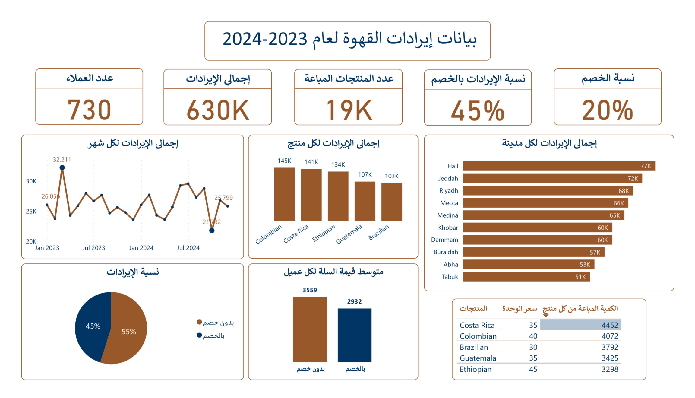

# ☕ داشبورد بيانات إيرادات القهوة

هذا المشروع عبارة عن داشبورد في Power BI لتحليل بيانات إيرادات القهوة لعام 2023–2024.  
الهدف هو استخراج مؤشرات حول الإيرادات، المنتجات، وسلوك العملاء و تشمل اللوحة المرئية مؤشرات تفاعلية وفلاتر ديناميكية حسب المنتج والمنطقة، مع حسابات باستخدام DAX لاستخراج أهم النتائج.

---

## 🛠 الأدوات المستخدمة
- Power BI  
- Excel (مصدر البيانات)  
- DAX (Measures)  
- Data Modeling
---
## 🎯 الأهداف
- تحليل مبيعات وإيرادات القهوة على مدار عامين  
- تحديد أكثر المنتجات مبيعًا والمناطق الأكثر ربحية  
- توفير رؤى تساعد في تحسين القرارات التجارية
---

## 📊 نظرة عامة
- إجمالي الإيرادات: 630K  
- عدد العملاء: 730  
- عدد المنتجات المباعة: 19K  
- نسبة الخصم: 20%  

---

## 🏆 أهم النتائج
- أكثر منتج مبيعًا: Costa Rica (145K)  
- أعلى مدينة من حيث الإيرادات: Hail (77K)/حائل  
- 45% من الإيرادات ناتجة من الخصومات  
- متوسط قيمة السلة انخفض من 3559 (بدون خصم) إلى 2932 (مع خصم)  

---

## 💡 تحليل الخصم
- 45% من الإيرادات ناتجة من الخصومات  
- متوسط قيمة السلة مع الخصم: 2932  
- متوسط قيمة السلة بدون خصم: 3559  

📌 الاستنتاج: الخصم ساعد في زيادة حجم المبيعات وجذب عملاء أكثر، لكنه قلّل من متوسط إنفاق العميل.  
مدى فائدة الخصم يعتمد على هدف الشركة:  
- إذا الهدف زيادة الانتشار وعدد العملاء → الخصم مفيد.  
- إذا الهدف زيادة الربحية من كل عميل → الخصم قلل من الفائدة.  

---

## 📷 لقطات من الداشبورد

---

#### 📂 الملفات في المشروع
- https://github.com/Muna5abdullah/Coffee-Sales.Revenue-Dashboard/blob/main/Coffee%20Revenue%20Dashboard.pbix →ملف الاصلي  Power BI  
- https://github.com/Muna5abdullah/Coffee-Sales.Revenue-Dashboard/blob/main/Coffee%20revenue%20dashboard.pdf → نسخة داشبورد 
---
#### 📂 مصدر البيانات
 - https://www.kaggle.com/datasets/halaturkialotaibi/coffee-bean-sales-dataset 
 
